> **Open to junior backend / data roles.** Greece or EU remote, from 2026.
> [email](mailto:davedev0406@gmail.com) · [LinkedIn](https://www.linkedin.com/in/david-gavriilidis-55707b252/)

---

### Work

<details>
<summary><code>openchartexcavator</code> — pulling structured data out of pages that refuse to be parsed</summary>

<br>

**PROBLEM** — Client-side rendering broke the cheap approach. `requests` + a
parser gets you an empty `<div id="root">`, so anything worth extracting has to
be harvested after the JavaScript has run.

**APPROACH** — Selenium driving headless Chrome, with extraction logic split
into independent modules under `components/`. When a target site changes its
DOM, one module breaks instead of the whole run.

**THE HARD PART** — Synchronisation. Fixed `sleep()` calls are either too slow
or too flaky; implicit waits paper over `StaleElementReferenceException`
without fixing it. Explicit waits on element state made runs survive slow and
throttled connections.

**WHAT I'D CHANGE** — Selenium is a heavy dependency for what this does; a
CDP-level driver like Playwright would cut startup cost significantly. There
are also no tests against recorded fixtures, which is the first thing I'd add.

[→ repository](https://github.com/vwdshka/OpenChartExcavator)

</details>

<details>
<summary><code>myData.Client</code> — a typed .NET client for the API a Greek business legally can't avoid</summary>
<br>
 
**PROBLEM** — Every business in Greece is required to transmit invoice data to
AADE's myDATA platform in real time. The official spec is a formal XSD/XML
contract with no first-party .NET client, so integrating it means hand-rolling
serialization and hoping the wire format was read correctly.
 
**APPROACH** — Wire models generated straight from AADE's XSDs, kept internal;
a hand-written public model on top; and a mapping layer between the two, so a
schema revision from AADE doesn't force a breaking change on anyone using the
package.
 
**THE HARD PART** — `SendInvoices` returns HTTP 200 even when some invoices in
the batch failed validation — business errors arrive as data inside a
successful response, not as an exception. That meant designing a result type
that correlates each outcome back to the invoice that produced it, rather than
the usual throw-on-failure model.
 
**WHAT I'D CHANGE** — No real sandbox capture of a successful `SendInvoices`
call exists yet — every attempt against AADE's dev environment came back with
an undocumented timing-related rejection (error 263) that isn't described in
any published spec. That's the next thing to chase down, not something to
paper over with a synthetic fixture.
 
[→ repository](https://github.com/vwdshka/myData-Client-Lib)
 
</details>

<details>
<summary><code>tabsesh</code> — a tab manager with a terminal instead of a settings page</summary>
<br>
 
**PROBLEM** — Browser tab managers are either a bookmarks-bar clone or a
subscription product that wants a login. I wanted one keyboard-driven tool
with no backend, where closing 40 tabs is reversible rather than a gamble.
 
**APPROACH** — Chrome's own bookmarks as the only data store — no database,
sync comes free from the browser account. A single core module with no UI
code at all, called identically by a popup, a full-page app, and an
in-browser terminal, so all three interfaces are always in sync.
 
**THE HARD PART** — Manifest V3 service workers get killed and restarted by
the browser at any moment, which breaks a plain `setTimeout`. Timed focus
sessions needed `chrome.alarms` instead, since that's the one timer primitive
that survives the worker going idle mid-countdown.
 
**RESULT** — 73 Vitest tests against a small in-memory fake for
`chrome.bookmarks`/`tabGroups` (the standard WXT test fake doesn't implement
either), which caught two real bugs before shipping: a delete/undo race when
two deletions landed in the same millisecond, and a bug in the fake browser
library itself.
 
[→ repository](https://github.com/vwdshka/tabsesh)
 
</details>


<details>
<summary><code>llm-fake-news-detector</code> — classification over text nobody cleaned first</summary>

<br>

**PROBLEM** — TODO: one sentence. What decision does the model actually make,
and on whose data?

**APPROACH** — TODO: model, features, why that one and not the obvious
baseline.

**THE HARD PART** — TODO: the thing that took three days. Class imbalance?
Leakage between train and test? Evaluation that looked great and meant nothing?

**RESULT** — TODO: a number, and the baseline it beat. "0.87 F1 against a
0.64 majority-class baseline" beats any adjective you could write here.

[→ repository](https://github.com/vwdshka/LLM-Fake-News-Detector)

</details>

<details>
<summary><code>cozychatnoui</code> — a chat server with no UI to hide behind</summary>

<br>

**PROBLEM** — TODO: why build this rather than use a library?

**APPROACH** — TODO: transport, concurrency model, how state is held.

**THE HARD PART** — TODO: concurrent connections? Message ordering? Clean
disconnects?

[→ repository](https://github.com/vwdshka/CozyChatNoUI)

</details>

---

### Stack

Sorted by how much I'd trust myself in production

```console
$ stack --honest

reach for daily     Python · SQL · Git
used in anger       C# / .NET · JavaScript · Selenium · Docker
know enough to      React · Firebase · Jupyter / pandas · scikit-learn
be dangerous
currently learning  fastapi and aws in greater detail
```

---

### How I work

- Planning and taking notes is the first step that I will take. Comprehension and analysis is key.
- I'd rather ship something small that handles the ugly input than something broad that only works on the happy path.
- I ask early. Two days lost to pride costs more than one awkward question.

---

### Education

**BSc (Hons) Software Development** — University of Bolton, August 2026

---

<sub>The header is an SVG generated by
<a href="tools/render_terminal.py"><code>tools/render_terminal.py</code></a> and
refreshed nightly by a GitHub Action. A custom, self-made README :).</sub>
