  

  
  
  

---

## Projects

### [`ixnos-data`](https://github.com/vwdshka/ixnos-data)
`C#` · `.NET` · `Python` · `PostgreSQL` · `Next.js`

Made Greek public procurement data (ΚΗΜΔΗΣ tenders and Διαύγεια spending decisions) searchable in Greek or Greeklish, reaching precision@10 of 0.84–1.00 on a 56-query test set, by building a Python ingestion pipeline, a .NET 10 API and a Next.js front end around PostgreSQL full-text search with trigram and phonetic matching. Before writing a schema I probed 614,000 real records, which is how I found that titles get cut at 100 characters and that some payments are typos worth over €100 million. The four services share only the database, so a mail outage can't take the site down. A static edition runs on [GitHub Pages](https://vwdshka.github.io/ixnos-data/) and refreshes every three hours.

### [`myData-Client-Lib`](https://github.com/vwdshka/myData-Client-Lib)
`C#` · `.NET` · `XML / XSD` · `HttpClient`

Built a typed .NET client for AADE's myDATA, the e-invoicing API every Greek business is legally required to report through. It catches 11 of AADE's server-side rejection codes on the caller's machine, by reproducing AADE's arithmetic and business rules in a validator that runs before anything is serialized. A batch can come back as HTTP 200 with some invoices rejected, so results are returned per invoice instead of as exceptions. The XSD-generated wire models sit behind a mapping layer, so a schema revision doesn't break the public API. Tested at four levels: unit, golden-file XML snapshots, contract tests against captured sandbox responses, and live sandbox calls.

### [`tabsesh`](https://github.com/vwdshka/tabsesh)
`TypeScript` · `Svelte` · `WebExtensions (MV3)` · `Vitest`

Turned closing 60+ tabs into one undoable command, covered by 73 Vitest tests that caught two bugs before release, by building a Manifest V3 extension where a popup, a full-page GUI and an in-browser terminal all call the same UI-free TypeScript core. Chrome's own bookmarks are the only data store, so sync between devices comes free with no server or account. Deleted folders sit in a trash for 48 hours, and timed focus sessions use `chrome.alarms` because a plain timer dies whenever the service worker is killed.

### [`OpenChartExcavator`](https://github.com/vwdshka/OpenChartExcavator)
`Python` · `Selenium` · `WebDriver` · team project

Owned the back end of a four-person open-source app that lists every business in an area a user picks on Google Maps (names, links, images, reviews and details), for trip planning, local market research and finding sales leads. Google Maps only renders client-side, so the back end drives headless Chrome through Selenium, with the extraction split into six independent `fetch_` modules so a change to Google's markup breaks one module instead of the whole run. A dedicated wait module holds off each action until the page is ready, which helps avoid Google's automation blocking. Explicit waits on element state replaced fixed sleeps and stopped `StaleElementReferenceException` failures on slow connections. Google changes its DOM often, so XPath selectors are a stopgap that needs ongoing monitoring. I also built parts of the Flutter front end so it worked cleanly with the back end; teammates built the rest of the app.

### [`CozyChatNoUI`](https://github.com/vwdshka/CozyChatNoUI)
`C#` · `.NET` · `TCP Sockets` · `WPF`

Built real-time multi-user chat over raw TCP, tested with 20 concurrent users and no noticeable message delay, with a central server broadcasting every message to all connected clients. I handled message framing myself: TCP has no message boundaries, so `NetworkStream` reads collect in a `MemoryStream` until a full packet arrives. The WPF client does network I/O on background threads so the UI never blocks. The server uses one thread per connection, which limits how many clients it can handle; async socket I/O would fix that.

### [`LLM-Fake-News-Detector`](https://github.com/vwdshka/LLM-Fake-News-Detector)
`Python` · `scikit-learn` · `TensorFlow` · `Transformers` · `SHAP` · `Flask`

Built a misinformation detector that runs three models side by side (a TF-IDF logistic regression baseline, a bidirectional LSTM and BERT), reaching 98.42%, 99.91% and 99.74% test accuracy against an 85% target. Scores that high on a static dataset looked suspicious, so I tested the models on real articles from outside it and used SHAP to see which words drove each prediction. The models had learned shortcuts: publisher names like "Reuters" and dash characters were enough to flip a verdict. I fixed this with regex cleaning that strips those signals before training and inference. Splitting the app into modules and loading BERT in the background brought prediction time from about 1.5 seconds down to 8–10 ms, served through a Flask web app that shows all three verdicts together.

---

## Technical Capabilities

| Domain | Technologies |
| :-- | :-- |
| **Languages** | Python · C# · TypeScript · JavaScript · Java · SQL |
| **Backend** | FastAPI · Flask · Java Spring Boot · .NET · PostgreSQL · REST API design · TCP socket programming |
| **Frontend** | React · Next.js · Svelte · TypeScript · Browser Extensions (WebExtensions API) |
| **Data & ML** | pandas · scikit-learn · TensorFlow · SHAP · Jupyter · Selenium · structured data extraction |
| **Infrastructure** | Docker · Git · GitHub Actions · Firebase · AWS (foundational) |

---

## Education

**BSc (Hons) Software Development** — University of Greater Manchester, August 2026

---

The header is an animated SVG rendered from <a href="./tools/render_terminal.py"><code>tools/render_terminal.py</code></a>. It types once, holds the complete output for 20 seconds, then restarts.
